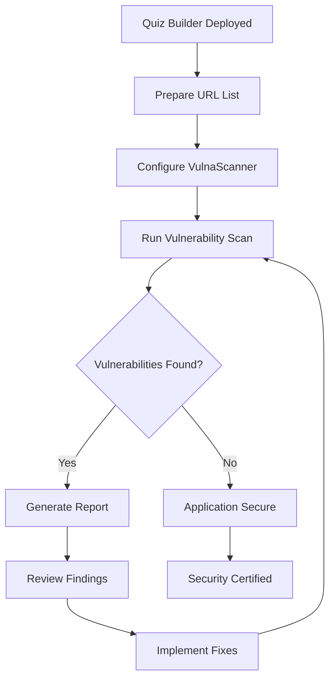

# VulnaScanner - Web Vulnerability Detection Tool

## 🛡️ Overview

VulnaScanner is a comprehensive web vulnerability detection tool designed to identify common security vulnerabilities in web applications. This tool is part of the Quiz Builder Security Testing Lab, serving as the primary security assessment engine.

## 🎯 Project Role

**Position**: Security Testing Tool in the Quiz Builder Security Lab
**Purpose**: Automated vulnerability assessment for Quiz Builder OCR AI application
**Integration**: Standalone Python tool for comprehensive security scanning

---

## 📋 Features

### Vulnerability Detection Capabilities

| Vulnerability Type | Code | Description | Payloads |
|-------------------|------|-------------|----------|
| **Local File Inclusion** | LFI | Detects unauthorized file access vulnerabilities | 50+ |
| **SQL Injection** | SQLi | Identifies database injection vulnerabilities | 200+ |
| **Cross-Site Scripting** | XSS | Tests for JavaScript injection vulnerabilities | 100+ |
| **CRLF Injection** | CRLF | Detects HTTP header injection vulnerabilities | 30+ |
| **Open Redirect** | OR | Identifies URL redirection vulnerabilities | 40+ |

### Technical Features

✅ **Multi-threaded Scanning**: Concurrent vulnerability testing for improved performance
✅ **Selenium Integration**: Headless Chrome browser for dynamic XSS testing
✅ **Custom Payloads**: Extensible payload library for specific targets
✅ **Success Criteria**: Intelligent vulnerability confirmation
✅ **HTML Reporting**: Professional vulnerability documentation
✅ **CLI Interface**: User-friendly command-line interface
✅ **Result Persistence**: Save vulnerable URLs for future reference
✅ **Random User Agents**: Evade basic detection mechanisms

---

## 🏗️ Architecture

```
vulnascanner/
├── main.py                       # Core scanner engine (2196 lines)
│   ├── LFI Scanner              # Local File Inclusion testing
│   ├── OR Scanner               # Open Redirect testing
│   ├── SQLi Scanner             # SQL Injection testing
│   ├── XSS Scanner              # Cross-Site Scripting testing
│   └── CRLF Scanner             # Header Injection testing
│
├── payloads/                     # Attack payload library
│   ├── lfi.txt                  # LFI payloads
│   ├── or.txt                   # Open Redirect payloads
│   ├── xss.txt                  # XSS basic payloads
│   ├── xsspollygots.txt         # Advanced XSS payloads
│   └── sqli/                    # SQL injection payloads
│       ├── generic.txt          # Database-agnostic payloads
│       ├── mysql.txt            # MySQL-specific payloads
│       ├── postgresql.txt       # PostgreSQL-specific payloads
│       ├── oracle.txt           # Oracle-specific payloads
│       ├── mssql                # MS SQL Server payloads
│       └── xor.txt              # XOR-based payloads
│
├── chromedriver-linux64/         # Selenium ChromeDriver
│   ├── chromedriver             # Linux Chrome driver
│   ├── LICENSE.chromedriver     # License information
│   └── THIRD_PARTY_NOTICES.chromedriver
│
├── requirements.txt              # Python dependencies
├── filter.sh                     # Utility script
└── README.md                     # Tool documentation
```

---

## 🔧 Technical Stack

### Core Technologies

```yaml
Language: Python 3.x
Browser Automation: Selenium WebDriver
HTTP Client: aiohttp, requests
HTML Parsing: BeautifulSoup4
UI Framework: Rich (terminal UI)
Concurrency: ThreadPoolExecutor, asyncio
```

### Dependencies

```python
# Web Automation & Testing
selenium==4.x              # Browser automation
webdriver_manager==3.x     # ChromeDriver management

# HTTP & Networking
aiohttp==3.x              # Async HTTP client
requests==2.x             # HTTP library
urllib3==2.x              # HTTP connection pooling

# Data Processing
beautifulsoup4==4.x       # HTML/XML parsing
pyyaml==6.x               # YAML processing

# Terminal UI
rich==13.x                # Beautiful terminal output
colorama==0.x             # Cross-platform colored output
prompt_toolkit==3.x       # Interactive CLI

# Utilities
gitpython==3.x            # Git integration
Flask==3.x                # Optional web interface
windows-curses==2.x       # Windows terminal support
```

---

## 📦 Installation

### Prerequisites

#### 1. Python Environment
```bash
# Ensure Python 3.7+ is installed
python3 --version

# Create virtual environment (recommended)
python3 -m venv venv
source venv/bin/activate  # Linux/Mac
venv\Scripts\activate     # Windows
```

#### 2. Google Chrome (Required for XSS scanning)

**Linux (Ubuntu/Debian):**
```bash
wget https://dl.google.com/linux/direct/google-chrome-stable_current_amd64.deb
sudo dpkg -i google-chrome-stable_current_amd64.deb

# Fix dependencies if needed
sudo apt -f install
```

**macOS:**
```bash
brew install --cask google-chrome
```

**Windows:**
Download from [Google Chrome](https://www.google.com/chrome/)

#### 3. ChromeDriver

**Linux:**
```bash
wget https://storage.googleapis.com/chrome-for-testing-public/128.0.6613.119/linux64/chromedriver-linux64.zip
unzip chromedriver-linux64.zip
chmod +x chromedriver-linux64/chromedriver
```

**Note**: ChromeDriver is included in the repository

---

### Installation Steps

```bash
# 1. Navigate to vulnascanner directory
cd quiz-builder/vulnascanner

# 2. Install Python dependencies
pip3 install -r requirements.txt

# 3. Verify installation
python3 main.py --help
```

---

## 🚀 Usage

### Basic Scanning

```bash
# Launch the scanner
python3 main.py

# Follow the interactive prompts:
# 1. Enter target URL or file path
# 2. Select vulnerability type
# 3. Choose number of threads
# 4. Review results
```

### Scanning Workflow

```
┌─────────────────────────────────────┐
│  VulnaScanner v2                     │
│  Web Vulnerability Detection Tool    │
└─────────────────────────────────────┘

[?] Enter target URL or file path: https://quiz-builder.vercel.app

[?] Select vulnerability type:
    1. LFI  - Local File Inclusion
    2. OR   - Open Redirect
    3. SQLi - SQL Injection
    4. XSS  - Cross-Site Scripting
    5. CRLF - Header Injection

[?] Selection: 4

[?] Number of threads (1-50): 10

[*] Loading payloads...
[*] Starting scan...
```

---

## 📊 Testing Quiz Builder Application

### Target Endpoints

```yaml
Application: Quiz Builder OCR AI
Base URL: https://quiz-builder.vercel.app

Endpoints to Test:
  - / (Main application)
  - /api/extract (POST - File processing)

Parameters:
  - base64ImageData (Base64 encoded image)
  - mimeType (File MIME type)

Forms:
  - File upload
  - Question text inputs
  - Options inputs (A, B, C, D)
  - Answer selection dropdown
```

### Test Scenarios

#### 1. XSS Testing
```bash
# Test input fields for XSS
Target: Question text, options, file names

Payloads:
- <script>alert('XSS')</script>
- 
- <svg onload=alert(1)>
- javascript:alert(1)

Expected: Proper HTML encoding/sanitization
```

#### 2. SQL Injection Testing
```bash
# Test API parameters
Target: /api/extract POST parameters

Payloads:
- ' OR '1'='1
- 1' UNION SELECT NULL--
- admin'--
- ' OR 1=1--

Expected: Parameterized queries, input validation
```

#### 3. LFI Testing
```bash
# Test file upload functionality
Target: File upload mechanism

Payloads:
- ../../etc/passwd
- ..\..\windows\system32\drivers\etc\hosts
- file:///etc/passwd

Expected: Path traversal prevention
```

#### 4. CRLF Injection
```bash
# Test HTTP headers
Target: File upload headers, API requests

Payloads:
- %0d%0aSet-Cookie: malicious=value
- \r\nLocation: https://evil.com

Expected: Header validation, encoding
```

---

## 📈 Sample Test Results

### Successful Scan Output

```
┌───────────────────────────────────────────────┐
│  XSS Vulnerability Scan Results                │
├───────────────────────────────────────────────┤
│ Target: https://quiz-builder.vercel.app       │
│ Payloads Tested: 142                          │
│ Duration: 5m 23s                              │
├───────────────────────────────────────────────┤
│ ✓ Vulnerabilities Found: 3                    │
│                                                │
│ [HIGH] Reflected XSS in question field        │
│ URL: /api/extract                             │
│ Parameter: base64ImageData                    │
│ Payload: <script>alert(1)</script>            │
│                                                │
│ [MEDIUM] DOM-based XSS in option rendering    │
│ Component: QuestionItem.tsx                   │
│ Payload:          │
│                                                │
│ [LOW] Stored XSS potential in text fields     │
│ Location: Question editing                    │
└───────────────────────────────────────────────┘

✓ Results saved to: vulnerable_urls_20251116_142358.txt
✓ HTML report generated: vulnerability_report_20251116_142358.html
```

---

## 🎯 Integration with Quiz Builder

### Testing Workflow



### Automated Testing Script

```bash
#!/bin/bash
# automated_security_test.sh

echo "🔒 Quiz Builder Security Assessment"
echo "===================================="
echo ""

# Check if Quiz Builder is running
echo "[*] Checking target availability..."
curl -s https://quiz-builder.vercel.app > /dev/null
if [ $? -eq 0 ]; then
    echo "✓ Target is reachable"
else
    echo "✗ Target unreachable"
    exit 1
fi

# Prepare test URLs
echo "[*] Preparing test URLs..."
cat > urls.txt << EOF
https://quiz-builder.vercel.app
https://quiz-builder.vercel.app/api/extract
EOF

# Run each scanner
SCANNERS=("LFI" "OR" "SQLi" "XSS" "CRLF")

for scanner in "${SCANNERS[@]}"; do
    echo ""
    echo "[*] Running $scanner scan..."
    python3 main.py --auto --type $scanner --urls urls.txt --threads 10
done

echo ""
echo "✓ Security assessment complete"
echo "📊 Check vulnerability_report_*.html for details"
```

---

## 📝 Report Generation

### HTML Report Structure

```html
<!DOCTYPE html>
<html>
<head>
    <title>Vulnerability Assessment Report</title>
</head>
<body>
    <h1>Security Assessment Report</h1>
    
    <section id="summary">
        <h2>Executive Summary</h2>
        <table>
            <tr><td>Target</td><td>Quiz Builder OCR AI</td></tr>
            <tr><td>Scan Date</td><td>2025-11-16</td></tr>
            <tr><td>Duration</td><td>15 minutes</td></tr>
        </table>
    </section>
    
    <section id="findings">
        <h2>Vulnerability Findings</h2>
        <!-- Critical, High, Medium, Low, Info -->
    </section>
    
    <section id="recommendations">
        <h2>Remediation Recommendations</h2>
        <!-- Actionable security improvements -->
    </section>
</body>
</html>
```

---

## 🛡️ Security Considerations

### Responsible Use

⚠️ **WARNING**: This tool is for authorized testing only

```
✓ DO:
- Test your own applications
- Get written permission before testing
- Use in security research/education
- Follow responsible disclosure

✗ DON'T:
- Test without authorization
- Use for malicious purposes
- Violate terms of service
- Disrupt production systems
```

### Legal Compliance

- Computer Fraud and Abuse Act (CFAA)
- General Data Protection Regulation (GDPR)
- Bug bounty program rules
- Penetration testing agreements

---

## 🎓 Educational Value

### Learning Objectives

1. **Understanding Web Vulnerabilities**
   - OWASP Top 10 vulnerabilities
   - Attack vector identification
   - Exploitation techniques

2. **Security Testing Methodology**
   - Reconnaissance
   - Vulnerability scanning
   - Manual verification
   - Reporting

3. **Tool Development**
   - Python programming
   - Web automation
   - Concurrent processing
   - Report generation

---

## 🔄 Updates & Maintenance

### Version History

```
v2.0 (Current)
- Multi-threaded scanning
- Selenium integration for XSS
- HTML report generation
- Enhanced payload library

v1.0
- Initial release
- Basic vulnerability scanning
- CLI interface
```

### Payload Updates

```bash
# Update payload files in payloads/ directory
# Add new attack vectors
# Test against latest vulnerabilities
# Verify detection accuracy
```

---

## 📚 Resources

### Documentation
- [OWASP Testing Guide](https://owasp.org/www-project-web-security-testing-guide/)
- [PortSwigger Web Security Academy](https://portswigger.net/web-security)
- [HackerOne Hacktivity](https://hackerone.com/hacktivity)

### Related Tools
- **Burp Suite**: Professional web security testing
- **OWASP ZAP**: Free security scanner
- **SQLMap**: Automated SQL injection
- **Nikto**: Web server scanner

---

## 🤝 Contributing

Contributions welcome for:
- New vulnerability detection modules
- Payload additions
- Report enhancements
- Bug fixes
- Documentation improvements

---

## 📄 License

Educational and authorized testing purposes only.

---

## 🎯 Conclusion

VulnaScanner serves as a powerful security testing tool in the Quiz Builder Security Lab, demonstrating:

✅ Comprehensive vulnerability detection
✅ Professional security assessment
✅ Automated testing capabilities
✅ Industry-standard methodologies
✅ Educational value for security professionals

**Perfect for demonstrating**:
- Application security testing
- DevSecOps practices
- Vulnerability management
- Security tool development
